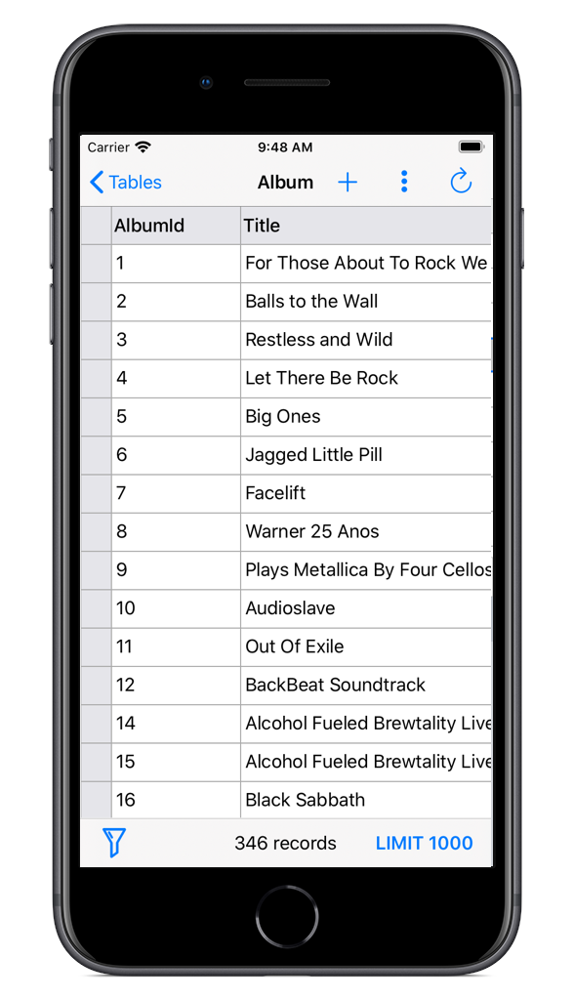
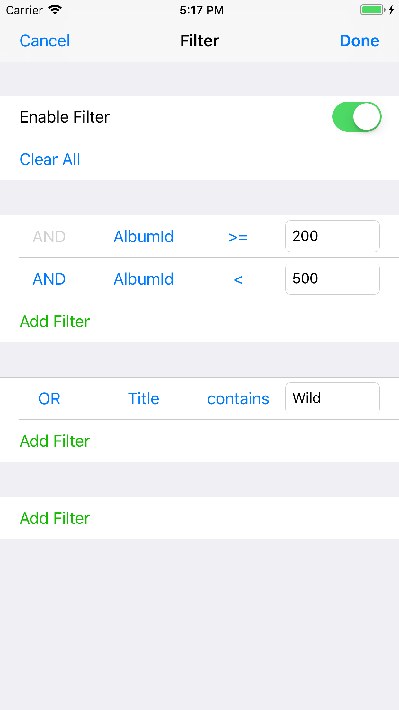
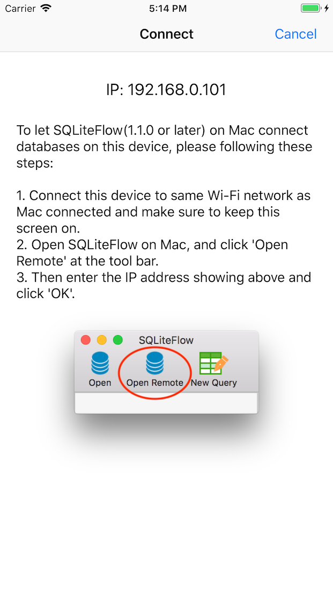
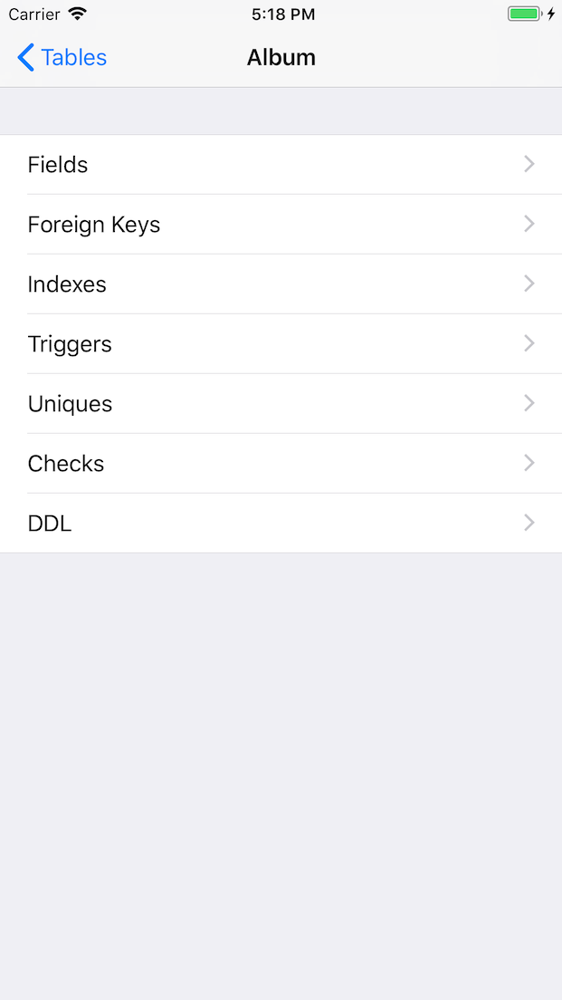
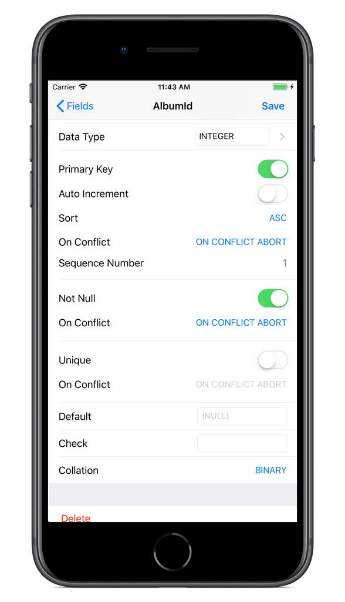
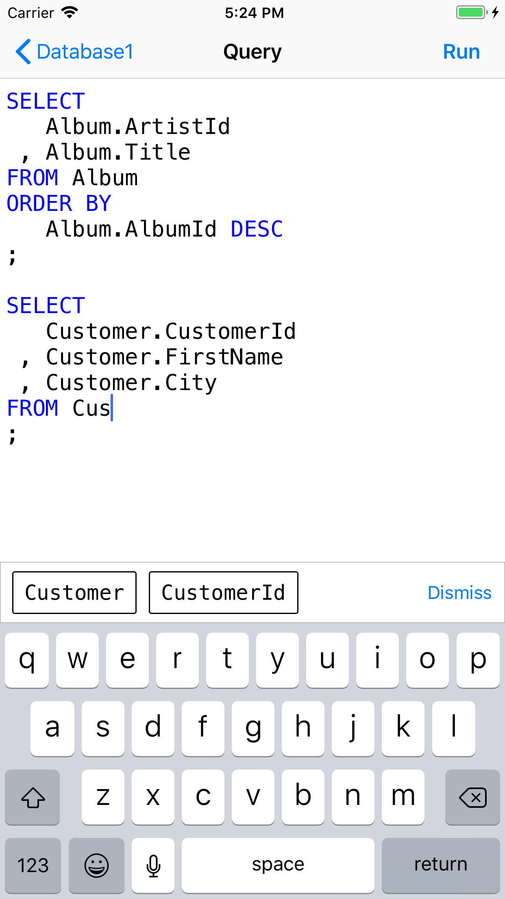
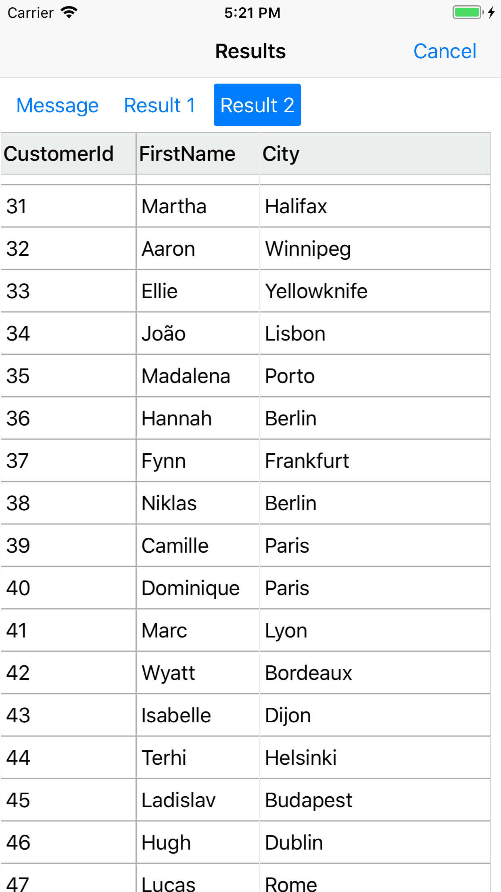

## Introduction
SQLiteFlow is a database editor for SQLite 3.

## Platform
iOS 11.0+ / [macOS 10.12+](/)

## Download

## Features

**Data Viewer**

- View, edit or add table data.
- View table data with a convenient filter.

*Data Viewer & Filter*
 

**Connect**

• Allow SQLiteFlow on Mac remote connect SQLite database on iPhone or iPad.

*Connect*
 

**Alter Table**

- View, edit or add table fields, indexes, foreign keys, checks.
- View triggers.
- View DDL.

*Alter Table*
 

**Query Editor**

- Execute query and show query results.
- Format query.
- Syntax highlighting.
- Auto completion.

*Query Editor*
 

## Support or Contact

Have any questions? Create a issue [here](https://github.com/SQLiteFlow/SQLiteFlow-Issues/issues).
