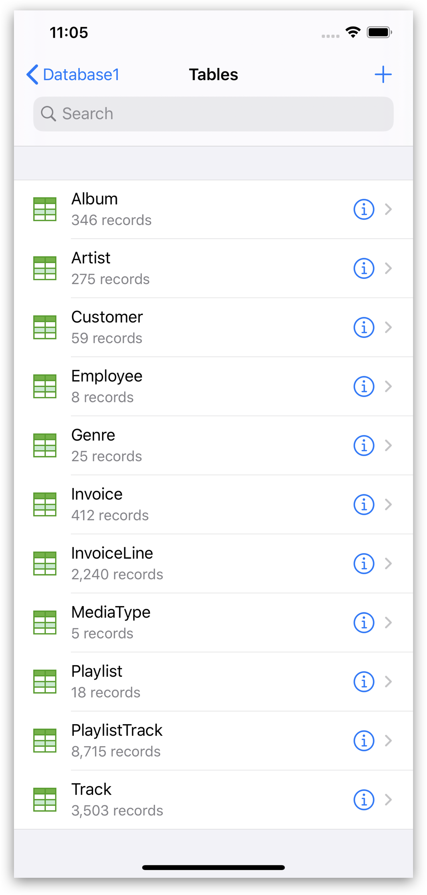
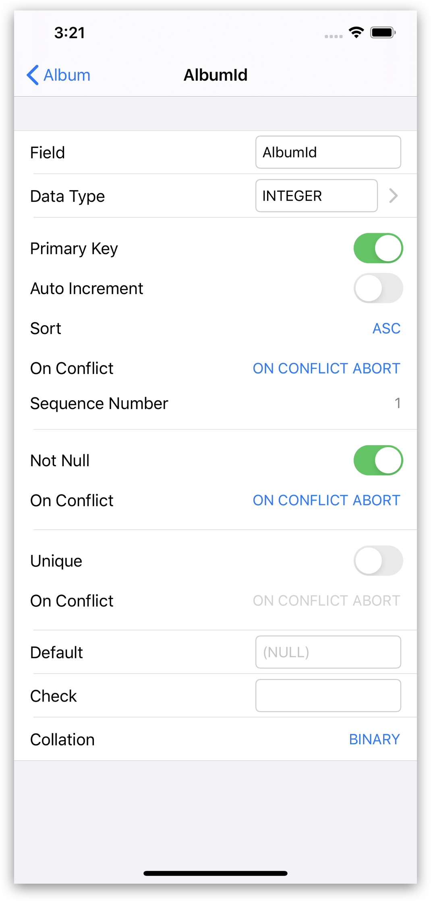
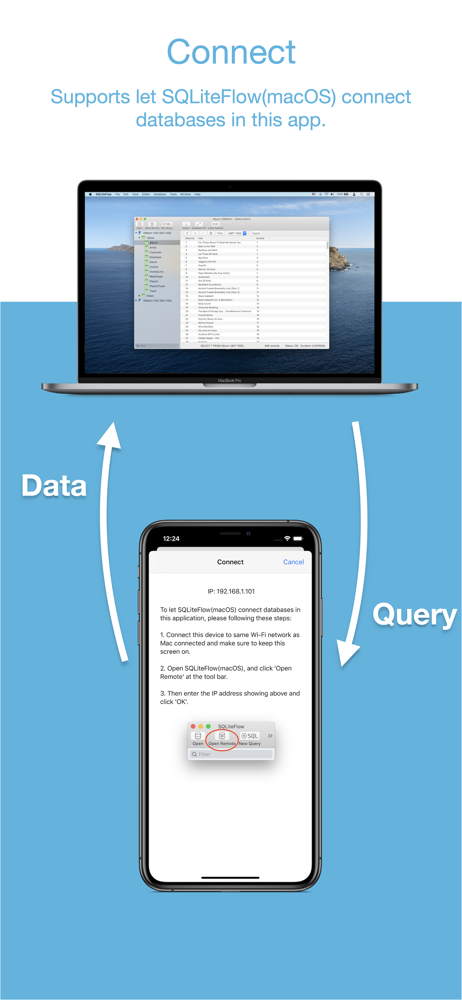
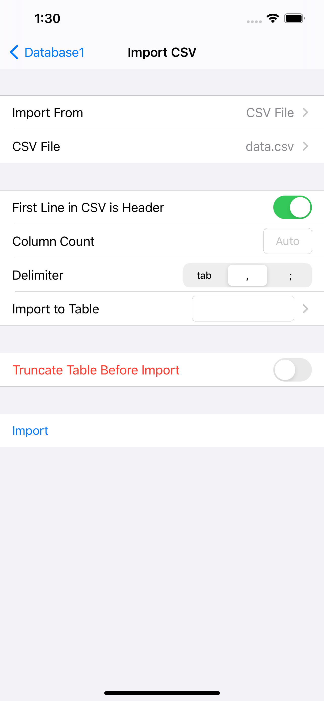

## Introduction
SQLiteFlow is an SQLite editor for Mac & iOS which is intuitive, stable and reliable to use.

## Platform
[macOS 10.12+](/) / iOS 11.0+

## Download

## Features

**Database List**
- Manage databases. Supportes add, remove, duplicate, rename databases.
- Supports import database from iCould Drive by the file picker.
- Supports import/export database through Drag and Drop gestures.
- Supports create new datatbase.

*Database List*
 

**Table List**

- Supports display each table's name and records count.

*Table List*
 

**Query Editor**

- Multi-query execution.
- Syntax highlighting.
- SQL auto-completion.
- Format query.

*Query Editor - Multi-query Execution*
 

**Data Viewer**

- View, edit or add table data.
- View table data with a convenient data filter.

*Data Viewer*
 

*Data Filter*
 

**Alter Table**

- View, edit or add table fields, indexes, foreign keys, checks.
- View triggers.
- View DDL.

*Alter Table*
 

**Connect**

- Allow SQLiteFlow on Mac remote connect SQLite database in iPhone or iPad.

*Connect*
 

**Database Statistics**

- Supports show records count of each table.
- Supports show total size of each table
- Supports show size of each table's content.
- Supports show size of each table's indexes.

*Database Statistics*
 

**Database Diff**

- Supports generate SQL text that can let you transform a database into another.
- Supports show a summary of the differences between two databases.

*Database Diff*
 

 

**Import**

- Supports import CSV data.

*Import CSV data*
 

**Export**

- Supports export table/view data and query result to CSV format.

## Release Notes
[Release Notes](iOS/ReleaseNotes)

## Support or Contact

Have any questions or feature requests? Please feel free to [create an issue](https://github.com/SQLiteFlow/SQLiteFlow-Issues/issues).

