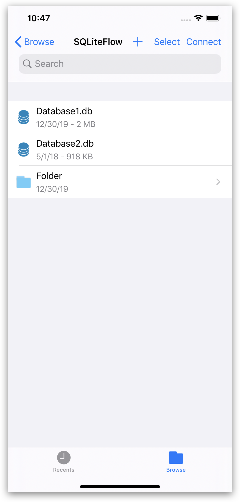
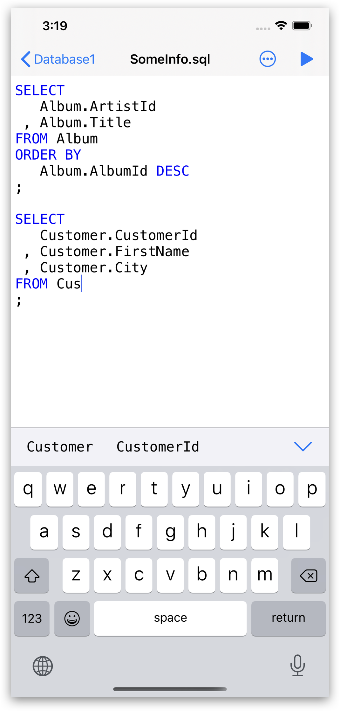
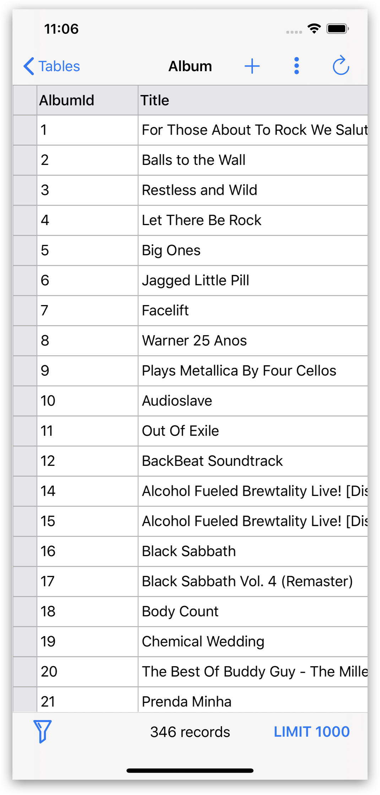
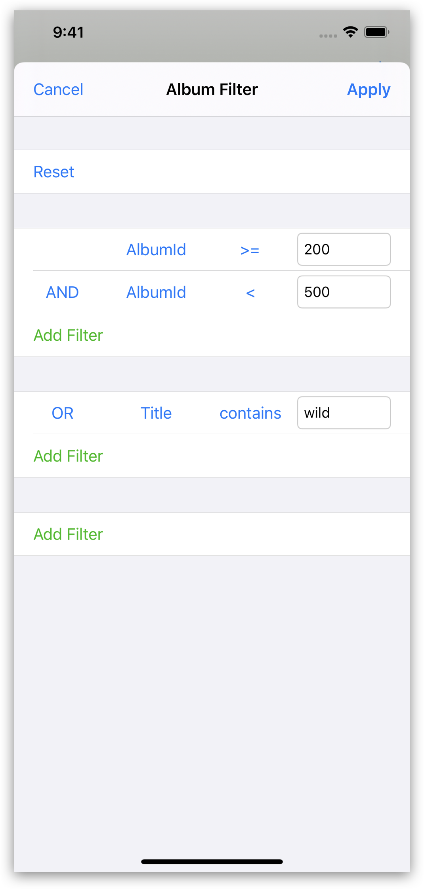
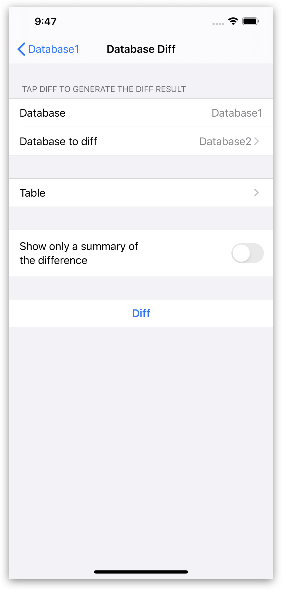

## Introduction
SQLiteFlow is an SQLite editor for Mac & iOS which is intuitive, stable and reliable to use.

## Platform
[macOS 10.14+](./) / iOS 14.1+

## Download
Version 5.1.1 | Aug 12, 2021 | <a href="iOS/ReleaseNotes" target="_blank">Release Notes</a>
  

## Features

**Browse**
- Manage files. Supports add, remove, duplicate, rename folders, SQLite databases, SQL files, CSV files, etc.
- Supports import database from iCloud Drive by the file picker.
- Supports open external SQL files, CSV files and Filter files in place.
- Supports open external folders in place.
- Supports show recents files.

*Browse*
 

**Table List**
- Supports display each table's name and records count.

*Table List*
 

**Query Editor**
- Multi-query execution.
- Syntax highlighting.
- SQL auto-completion.
- Format query.

*Query Editor - Multi-query Execution*
 

**Data Editor**
- View, edit or add table data.
- View table data with a convenient data filter.
- Sort records by tapping on column title.
- Edit blob as hex, show blob as image if possible.

*Data Editor*
 

*Data Filter*
 

**Alter Table**
- View, edit or add table fields, indexes, foreign keys, checks.
- View triggers.
- View DDL.

*Alter Table*
 

**Connect**
- Supports let SQLiteFlow(macOS) connect databases in this app.

 

**Database Statistics**
- Supports show records count of each table.
- Supports show total size of each table
- Supports show size of each table's content.
- Supports show size of each table's indexes.

*Database Statistics*
 

**Database Diff**
- Supports generate SQL text that can let you transform a database into another.
- Supports show a summary of the differences between two databases.

*Database Diff*
 

**Import**
- Supports import CSV data.

*Import CSV data*
 

**Export**
- Supports export table/view data and query result to CSV format.

**Multiple Windows**
- Supports multiple windows for iPadOS 13.

**Dark Mode**
- Supports dark mode for iOS 13.

**Languages**
- English \| [简体中文 (Chinese, Simplified)](/zh-Hans/iOS) \| [繁體中文 (Chinese, Traditional)](/zh-Hant/iOS) \| [日本語 (Japanese)](/ja/iOS)

## Support or Contact
Have any questions or feature requests? Please feel free to <a href="https://github.com/SQLiteFlow/SQLiteFlow-Issues/issues" target="_blank">create an issue</a>.

