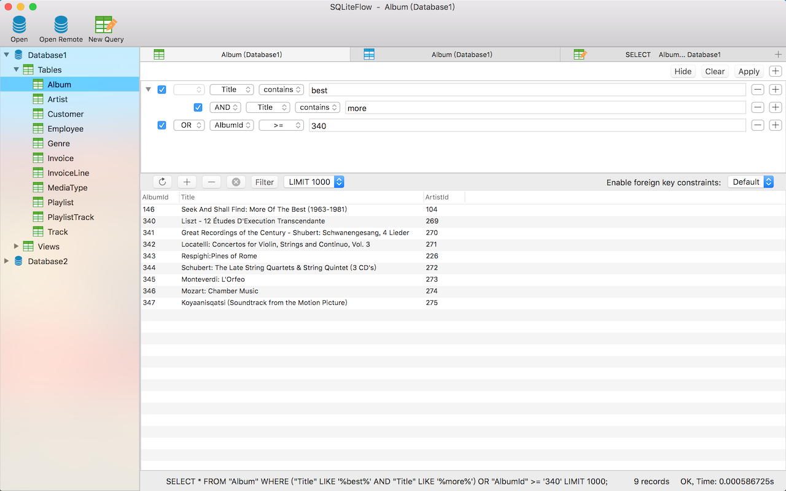
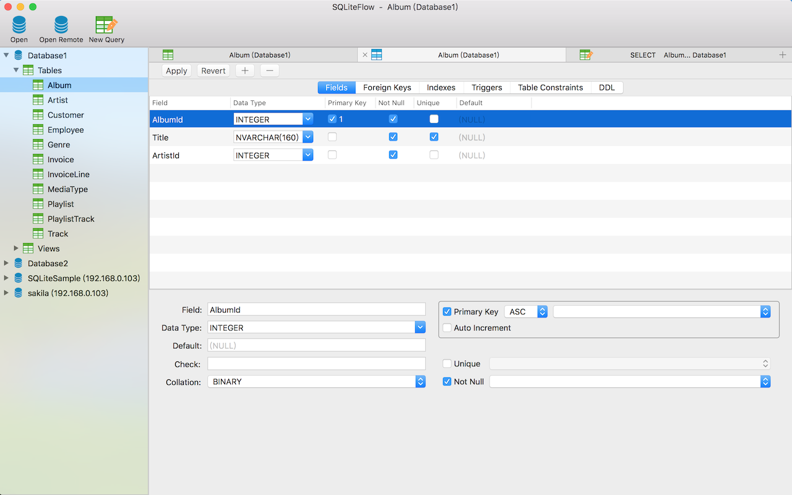
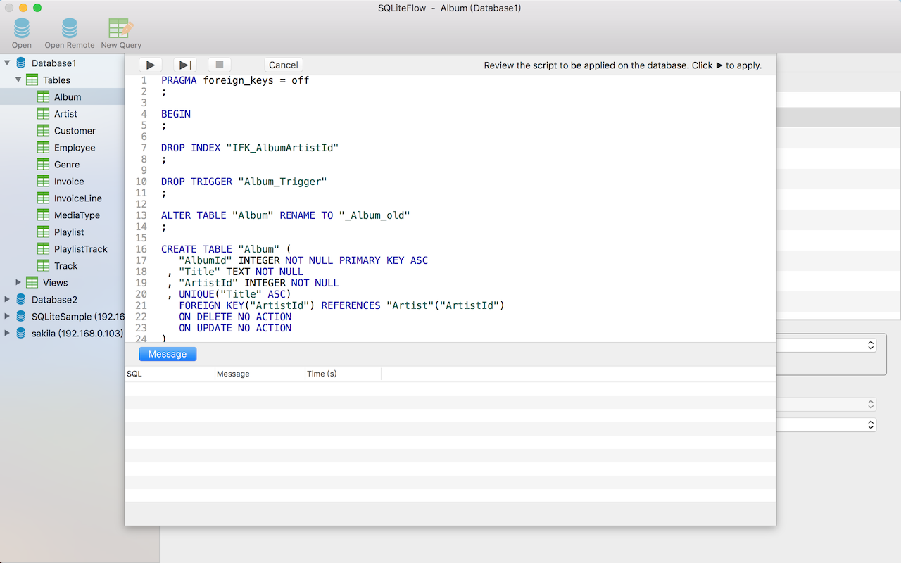
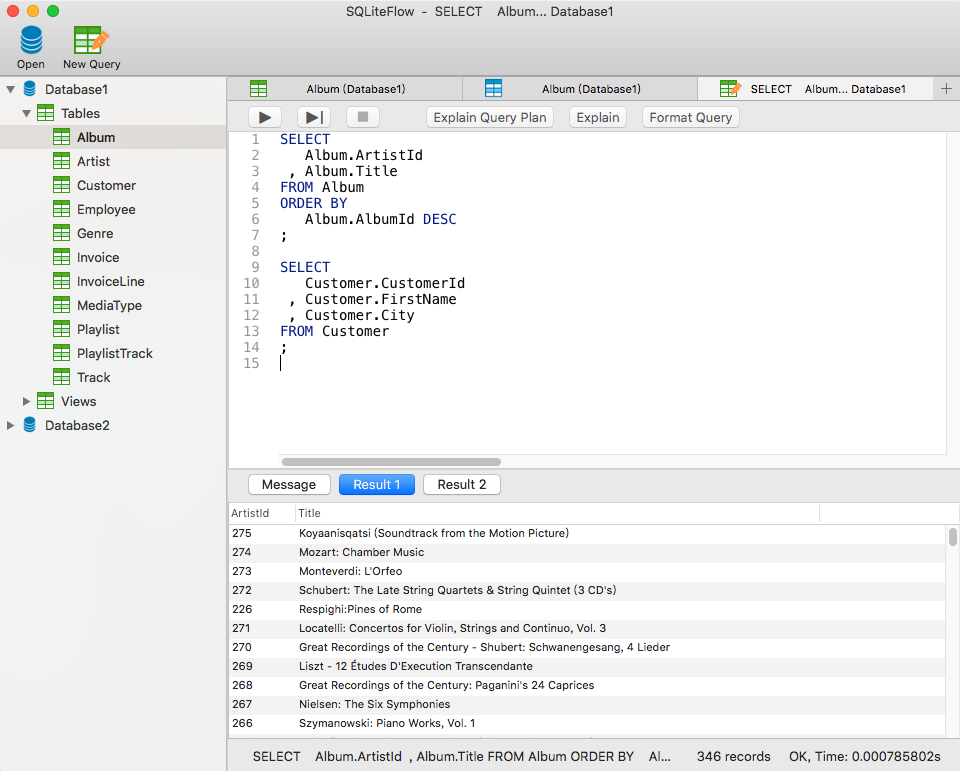
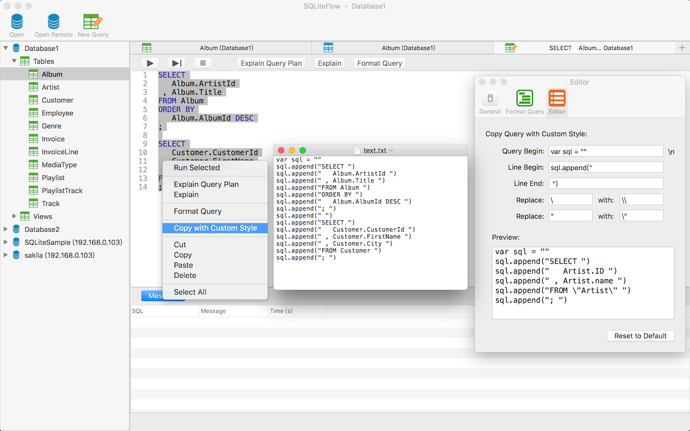

## Introduction
SQLiteFlow is a database editor for SQLite 3.

## Platform
macOS 10.12+ 

## Features

**Data Viewer**

- View, edit or add table data.
- View table data with a convenient filter. You can design many kind of filters like (A && B) \|\| C, A && (C \|\| B), etc.
- Copy data to CSV.

*Data Viewer*

**Alter Table**

- View, edit or add table fields, indexes, foreign keys, checks.
- View triggers.
- View DDL.
- Preview the query that for altering table.

*Alter Table - Fields*

*Alter Table - Preview*

**Query Editor**

- Execute query and show query results.
- Explain query.
- Format query.
- Auto completion.
- Copy query with custom style.

*Editor with Format Query support*

*Editor - Copy With Custom Style and It's setting*

**Other features**

- Drag drop to open databases.
- Handle database file name or directory changes.

## Download

## Support or Contact

Have any questions? Create a issue [here](https://github.com/SQLiteFlow/SQLiteFlow-Issues/issues).
