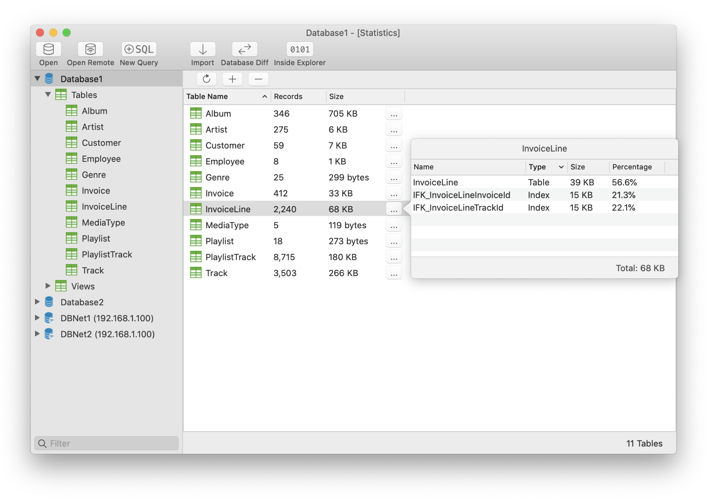

## Introduction
SQLiteFlow is an SQLite editor that always makes its best to be intuitive, stable and reliable for you to use. 

## Platform
macOS 10.12+ / [iOS 11.0+](iOS)

## Download

## Features

**Query Editor**

- Multi-query execution.
- Customize syntax highlighting.
- SQL auto-completion.
- Format query.
- Copy query with custom style.
- Supports toggle wrap lines.
- Explain query.
- Paste recent query sessions.
- Save the query to a file.
- Load the query from a file.
- Cmd+ to make the font bigger, Cmd- to make the font smaller.

*Query Editor - Multi-query Execution*

*Query Editor - Copy Query with Custom Style and It's Setting*

**Data Viewer**

- View, edit or add table data.
- View table data with a convenient data filter.
- Copy data to CSV.

*Data Viewer*

**Alter Table**

- View, edit or add table fields, indexes, foreign keys, checks.
- View triggers.
- View DDL.
- Preview the query that for altering table.

*Alter Table - Fields*

*Alter Table - Preview*

**Dark Mode**
- Supports Dark Mode for macOS Mojave.

*Dark Mode*

**Database Statistics**
- Display table counts and each table's record count.
- Display each table's storage consumed and storage consumed detail, including table data storage consumed and indexes storage consumed. (* Available on macOS 10.13+)

*Database Statistics*

**Database Diff**
- Supports generate SQL text that can let you transform a database into another.
- Supports show a summary of the differences between two databases.

**Remote Connect**
- Supports open remote SQLite database in iPhone or iPad with SQLiteFlow(iOS) installed.

*Remote Connect*

**Other features**

- Drag drop to open databases.
- Handle database file name or directory changes. 
  This makes SQLiteFlow can work friendly with your SQLite database in iOS simulator.
- Attach opened databases without any code. 
  This is a very handy feature that could save lots of your time from writing ATTACH DATABASE commands.

*Attach Opened Databases*

## Release Notes
[Release Notes](ReleaseNotes)

## Support or Contact

Have any questions or feature requests? Please feel free to [create an issue](https://github.com/SQLiteFlow/SQLiteFlow-Issues/issues).

