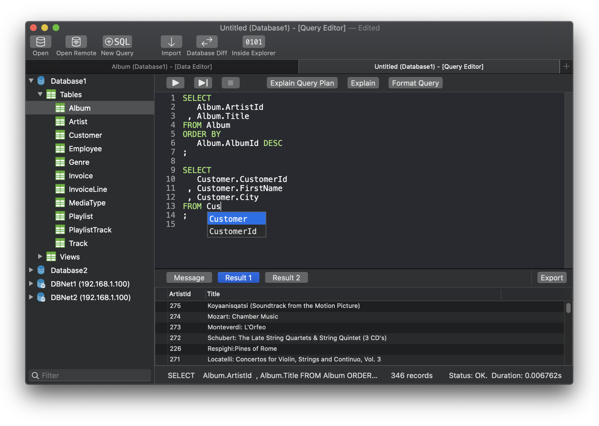

## Introduction
SQLiteFlow is a database editor for SQLite 3.

## Platform
macOS 10.12+ / [iOS 11.0+](iOS)

## Download

## Features

**Data Viewer**

- View, edit or add table data.
- View table data with a convenient data filter.
- Copy data to CSV.

*Data Viewer*

**Alter Table**

- View, edit or add table fields, indexes, foreign keys, checks.
- View triggers.
- View DDL.
- Preview the query that for altering table.

*Alter Table - Fields*

*Alter Table - Preview*

**Query Editor**

- Execute query and show query results.
- Explain query.
- Format query.
- Syntax highlighting.
- Auto completion.
- Copy query with custom style.

*Editor with Format Query support*

*Editor - Copy With Custom Style and It's Setting*

**Remote Connect**
- Supports open remote SQLite database on iPhone or iPad with SQLiteFlow(iOS) installed.

*Open Remote Database*

**Other features**

- Drag drop to open databases.
- Handle database file name or directory changes. 
  This makes SQLiteFlow can work friendly with your SQLite database in iOS simulator.
- Attach opened databases without any code. 
  This is a very handy feature that could save lots of your time from writing ATTACH DATABASE commands.

*Attach Opened Databases without Any Code*

## Release Notes
[Release Notes](ReleaseNotes)

## Support or Contact

Have any questions or feature requests? Please feel free to create an issue [here](https://github.com/SQLiteFlow/SQLiteFlow-Issues/issues).
