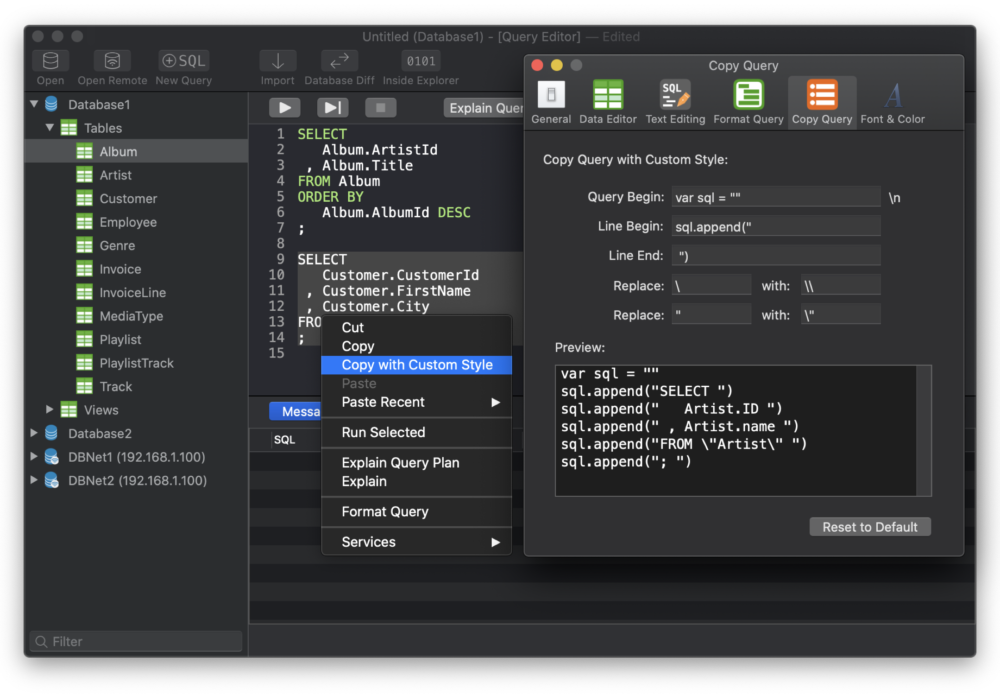
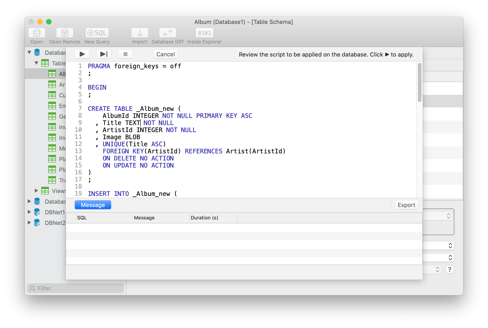
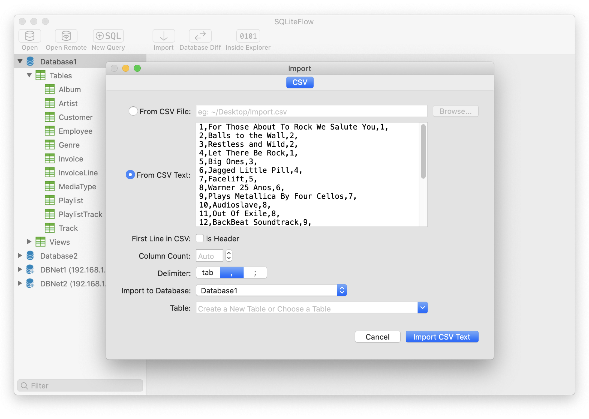
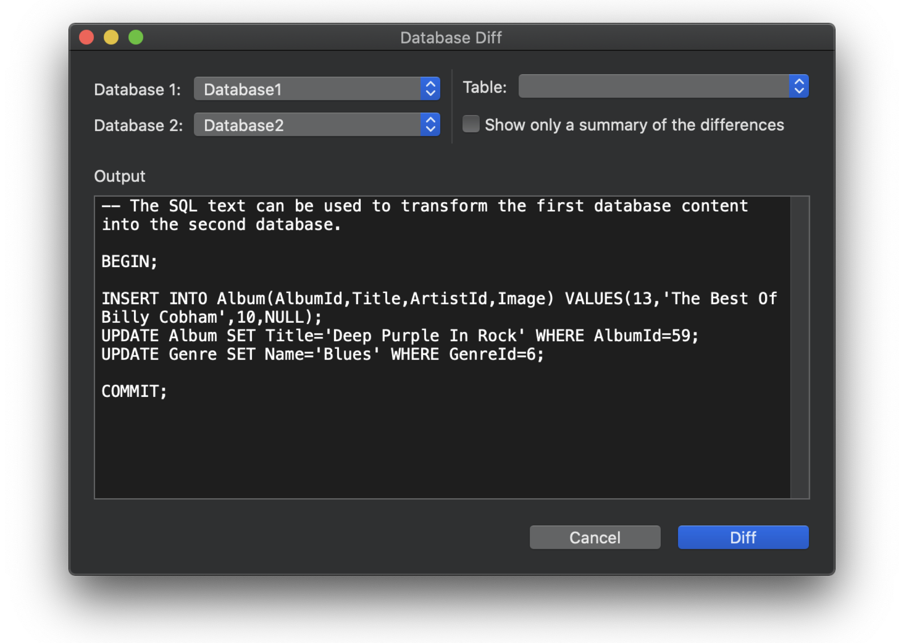

3.5.2 - Pending Release...
- Fix an issue that may cause Data Viewer showing empty records.

3.5.1 - Apr 25, 2019
- Fix an issue that may cause paid users see getting trial or getting full unlock screen.
For users who experiencing this issue, you can just click 'Get the Free Trial' to continue using the app as a workaround before updating to the fixed version.

## Introduction
SQLiteFlow is an SQLite editor for Mac & iOS which is intuitive, stable and reliable to use.

## Platform
macOS 10.12+ / [iOS 11.0+](iOS)

## Download

## Features

**Query Editor**

- Multi-query execution.
- Customize syntax highlighting.
- SQL auto-completion.
- Format query.
- Copy query with custom style.
- Paste recent query sessions.
- Explain query.

*Query Editor - Multi-query Execution*

*Query Editor - Copy Query with Custom Style and It's Setting*

**Data Viewer**

- View, edit or add table data.
- View table data with a convenient data filter.
- Copy data to CSV.

*Data Viewer*

**Alter Table**

- View, edit or add table fields, indexes, foreign keys, checks.
- View triggers.
- View DDL.
- Preview the query that for altering table.

*Alter Table - Fields*

*Alter Table - Preview*

**Import**
- Supports import CSV data.

*Import from CSV Text*

**Dark Mode**
- Supports Dark Mode for macOS Mojave.

*Dark Mode*

**Database Statistics**
- Display table counts and each table's record count.
- Display total size of each table, size of each table's content and size of each table's indexes. Requires macOS 10.13.

*Database Statistics*

**Database Diff**
- Supports generate SQL text that can let you transform a database into another.
- Supports show a summary of the differences between two databases.

**Remote Connect**
- Supports open remote SQLite database in iPhone or iPad with SQLiteFlow(iOS) installed.

*Remote Connect*

**Attach Database**
- Attach opened databases without any code. This is a very handy feature that could save lots of your time from writing ATTACH DATABASE commands.

*Attach Opened Databases*

**Drag and Drop**
- Drag and drop to open databases and sql scripts.
- Create multiple windows.

*Multiple windows*

**Handle Database File Name or Directory Changes**
- For instance, this makes SQLiteFlow can work friendly with your SQLite databases in iOS simulator.

**REGEXP operator**
- Supports REGEXP operator for local databases when 'REGEXP operator' is enabled in Preferences.

## Release Notes
[Release Notes](ReleaseNotes)

## Support or Contact

Have any questions or feature requests? Please feel free to [create an issue](https://github.com/SQLiteFlow/SQLiteFlow-Issues/issues).

