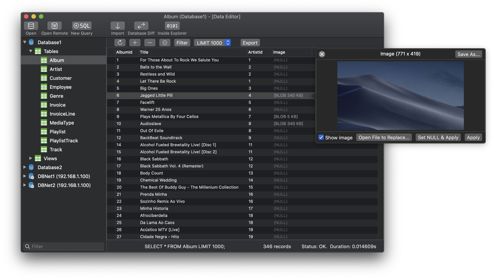
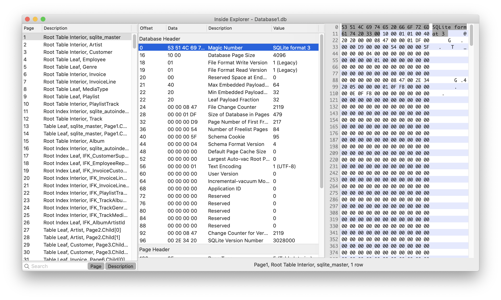

## Introduction
SQLiteFlow is an SQLite editor for Mac & iOS which is intuitive, stable and reliable to use.

## Platform
macOS 10.14+ / [iOS 13.0+](iOS)

## Download
Version 5.0.1 | May 6, 2021 | <a href="ReleaseNotes" target="_blank">Release Notes</a>
  

## Features

**Query Editor**

- Multi-query execution.
- Customize syntax highlighting.
- SQL auto-completion.
- Format query.
- Copy query with custom style.
- Paste recent query sessions.
- Explain query.

*Query Editor - Multi-query Execution*

*Query Editor - Copy Query with Custom Style and It's Setting*

**Data Editor**

- View, edit or add table data.
- View table data with a convenient data filter.
- Edit blob as hex, show blob as image if possible.
- Copy data to CSV.

*Data Editor*

**Table Schema**

- View, edit or add table fields, indexes, foreign keys, checks.
- View triggers.
- View DDL.
- Preview the query that for altering table.

*Alter Table - Fields*

*Alter Table - Preview*

**Import**
- Supports import CSV data.

*Import from CSV Text*

**Dark Mode**
- Supports Dark Mode for macOS 10.14+.

**Database Statistics**
- Display table counts and each table's record count.
- Display total size of each table, size of each table's content and size of each table's indexes.

*Database Statistics*

**Database Diff**
- Supports generate SQL text that can let you transform a database into another.
- Supports show a summary of the differences between two databases.

**Remote Connect**
- Supports open remote SQLite database in iPhone or iPad with SQLiteFlow(iOS) installed.

*Remote Connect*

**Attach Database**
- Attach opened databases without any code. This is a very handy feature that could save lots of your time from writing ATTACH DATABASE commands.

*Attach Opened Databases*

**Drag and Drop**
- Drag and drop to open databases and sql scripts.
- Create multiple windows.

**Inside Explorer**
- Show inside data structure of SQLite database file, journal file, WAL file and WAL-Index file.

*Inside Explorer*

**Handle Database File Name or Directory Changes**
- For instance, this makes SQLiteFlow can work friendly with your SQLite databases in iOS simulator.

**REGEXP operator**
- Supports REGEXP operator for local databases when 'REGEXP operator' is enabled in Preferences.

**Languages**
- English \| [简体中文 (Chinese, Simplified)](/zh-Hans) \| [繁體中文 (Chinese, Traditional)](/zh-Hant) \| [日本語 (Japanese)](/ja)

## Support or Contact
Have any questions or feature requests? Please feel free to <a href="https://github.com/SQLiteFlow/SQLiteFlow-Issues/issues" target="_blank">create an issue</a>.

