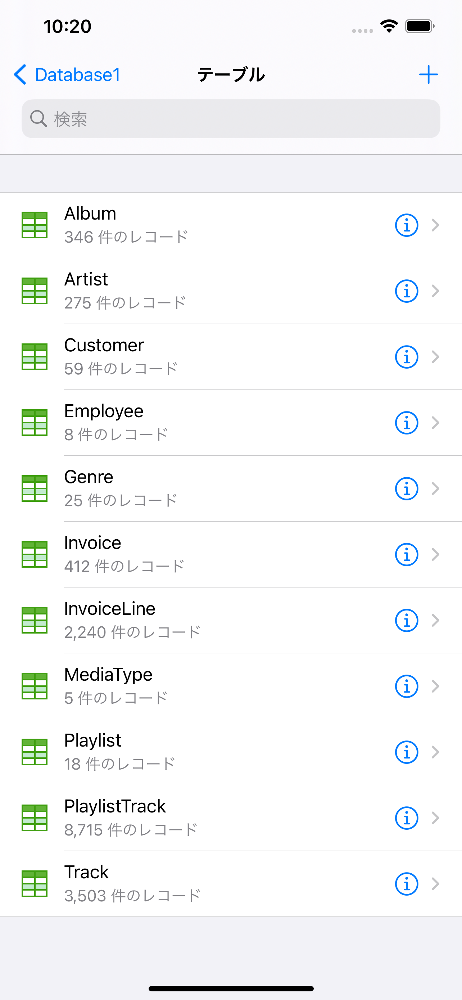
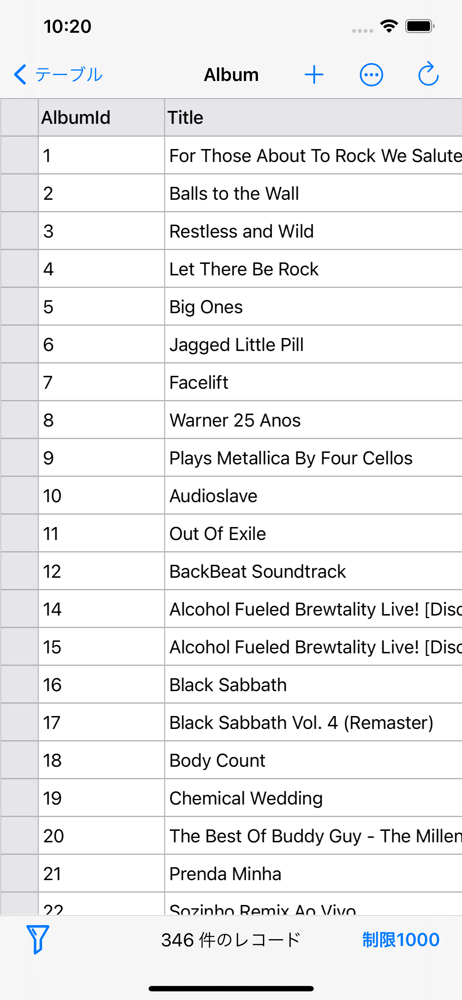

## 紹介
SQLiteFlowは、直感的で安定した信頼性の高いMacとiOS用のSQLiteエディタです。

## プラットフォーム
[macOS 10.14+](./) / iOS 14.1+

## ダウンロード
バージョン 5.1.1 | 2021-08-12 | <a href="iOS/ReleaseNotes" target="_blank">リリースノート</a>
  

## 機能

**参照**
- ファイルを管理します。追加、削除、複製、フォルダの名前変更、SQLiteデータベース、SQLファイル、CSVファイルなどをサポート
- ファイルピッカーによる iCloud ドライブからのデータベースのインポートをサポートします。
- 外部 SQL ファイル、CSV ファイル、およびフィルター ファイルを開きます。
- 外部フォルダを所定の場所で開くことができます。
- 最近のファイルを表示するサポート。

*参照*
 

**テーブルリスト**
- 各テーブルの名前とレコード数を表示できます。

*テーブルリスト*
 

**クエリ エディター**
- 複数のクエリの実行。
- 構文の強調表示。
- SQL のオートコンプリート。
- クエリを書式設定します。

*クエリ エディター - 複数クエリの実行*
 

**データ エディタ**
- テーブルデータの表示、編集、追加
- 便利なデータフィルタを使用してテーブルデータを表示します。
- 列のタイトルをタップしてレコードを並べ替えます。
- BLOB を 16 進数として編集し、可能であれば画像として BLOB を表示します。

*データ エディタ*
 

*データ フィルタ*
 

**表の変更**
- テーブルフィールド、インデックス、外部キー、チェックの表示、編集、追加。
- トリガーを表示します。
- DDL を表示します。

*表の変更*
 

**接続**
- サポートは、SQLiteFlow(macOS)は、このアプリでデータベースを接続してみましょう。

 

**データベース統計**
- 各テーブルのレコード数を表示するサポート。
- 各テーブルの合計サイズを表示するサポート
- 各テーブルのコンテンツの表示サイズをサポートします。
- 各テーブルのインデックスの表示サイズをサポートします。

*データベース統計*
 

**データベースの差分**
- データベースを別のデータベースに変換できる SQL テキストの生成をサポートします。
- 2 つのデータベース間の相違点の概要を示すサポート。

*データベースの差分*
 

**インポート**
- CSV データのインポートをサポートします。

*CSV データのインポート*
 

**エクスポート**
- CSV 形式へのテーブル/ビューデータとクエリ結果のエクスポートをサポートします。

**複数のウィンドウ**
- iPadOS 13 の複数のウィンドウをサポートしています。

**ダークモード**
- iOS 13 のダークモードをサポートします。

**言語**
- [English](/) \| [简体中文 (Chinese, Simplified)](/zh-Hans/iOS) \| [繁體中文 (Chinese, Traditional)](/zh-Hant/iOS) \|日本語 (Japanese)

## サポートまたはお問い合わせ
ご質問や機能のリクエストをお持ちですか? <a href="https://github.com/SQLiteFlow/SQLiteFlow-Issues/issues" target="_blank">問題を作成</a>して自由に感じてください。

