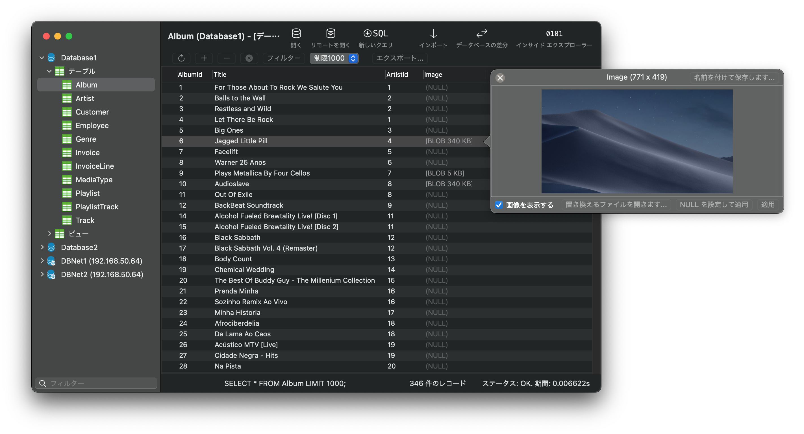
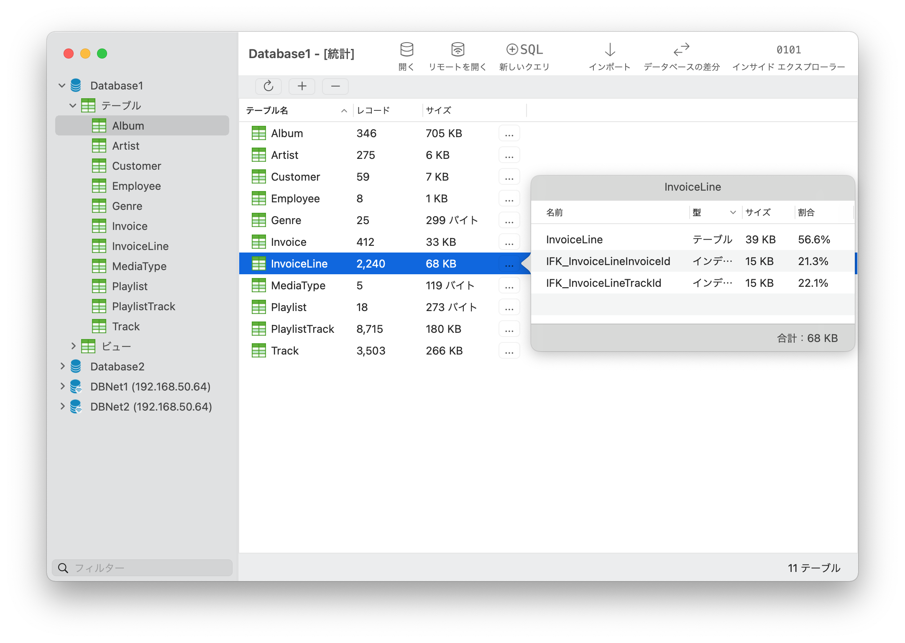
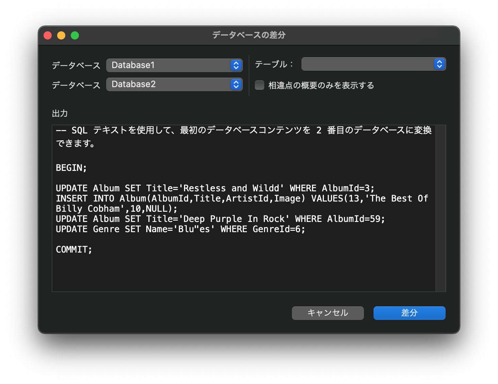
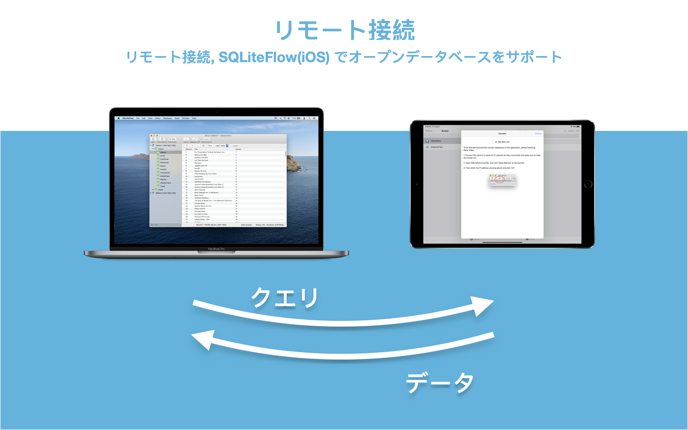

## 紹介
SQLiteFlowは、直感的で安定した信頼性の高いMacとiOS用のSQLiteエディタです。

## プラットフォーム
macOS 10.14+ / [iOS 13.0+](iOS)

## ダウンロード
バージョン 4.9.0 | 2021-03-28 | <a href="ReleaseNotes" target="_blank">リリースノート</a>
  

## 機能

**クエリ エディター**

- 複数のクエリの実行。
- 構文の強調表示をカスタマイズします。
- SQL のオートコンプリート。
- クエリを書式設定します。
- カスタム スタイルを使用してクエリをコピーします。
- 最近のクエリ セッションを貼り付けます。
- クエリを説明します。

*クエリ エディター - 複数クエリの実行*

*クエリ エディター - カスタム スタイルを使用したクエリのコピーと設定*

**データ エディタ**

- テーブルデータの表示、編集、追加
- 便利なデータフィルタを使用してテーブルデータを表示します。
- BLOB を 16 進数として編集し、可能であれば画像として BLOB を表示します。
- データを CSV にコピーします。

*データ エディタ*

**テーブル スキーマ**

- テーブルフィールド、インデックス、外部キー、チェックの表示、編集、追加。
- トリガーを表示します。
- DDL を表示します。
- テーブルを変更するためのクエリをプレビューします。

*テーブルの変更 - フィールド*

*テーブルの変更 - プレビュー*

**インポート**
- CSV データのインポートをサポートします。

*CSV テキストからインポート*

**ダークモード**
- macOS 10.14+のダークモードをサポートしています。

**データベース統計**
- テーブル数と各テーブルのレコード数を表示します。
- 各テーブルの合計サイズ、各テーブルの内容のサイズ、各テーブルのインデックスのサイズを表示します。

*データベース統計*

**データベースの差分**
- データベースを別のデータベースに変換できる SQL テキストの生成をサポートします。
- 2 つのデータベース間の相違点の概要を示すサポート。

**リモート接続**
- SQLiteFlow(iOS)がインストールされているiPhoneまたはiPadでオープンリモートSQLiteデータベースをサポートしています。

*リモート接続*

**データベースのアタッチ**
- 開いているデータベースをコードなしでアタッチします。これは非常に便利な機能で、ATTACH DATABASE コマンドの作成に時間を節約できます。

*開いているデータベースをアタッチする*

**ドラッグ アンド ドロップ**
- ドラッグアンドドロップしてデータベースとSQLスクリプトを開きます。
- 複数のウィンドウを作成します。

**インサイド エクスプローラー**
- SQLiteデータベースファイル、ジャーナルファイル、WALファイル、WALインデックスファイルのデータ構造を表示します。

*インサイド エクスプローラー*

**データベース ファイル名またはディレクトリの変更を処理する**
- たとえば、これは、SQLiteFlowは、iOSシミュレータでSQLiteデータベースと友好的に動作することができます。

**REGEXP 演算子**
- 環境設定で'REGEXP演算子'が有効になっている場合、ローカルデータベースのREGEXPオペレータをサポートします。

**言語**
- [English](/) \| [简体中文 (Chinese, Simplified)](/zh-Hans) \| [繁體中文 (Chinese, Traditional)](/zh-Hant) \|日本語 (Japanese)

## サポートまたはお問い合わせ
ご質問や機能のリクエストをお持ちですか? <a href="https://github.com/SQLiteFlow/SQLiteFlow-Issues/issues" target="_blank">問題を作成</a>して自由に感じてください。

