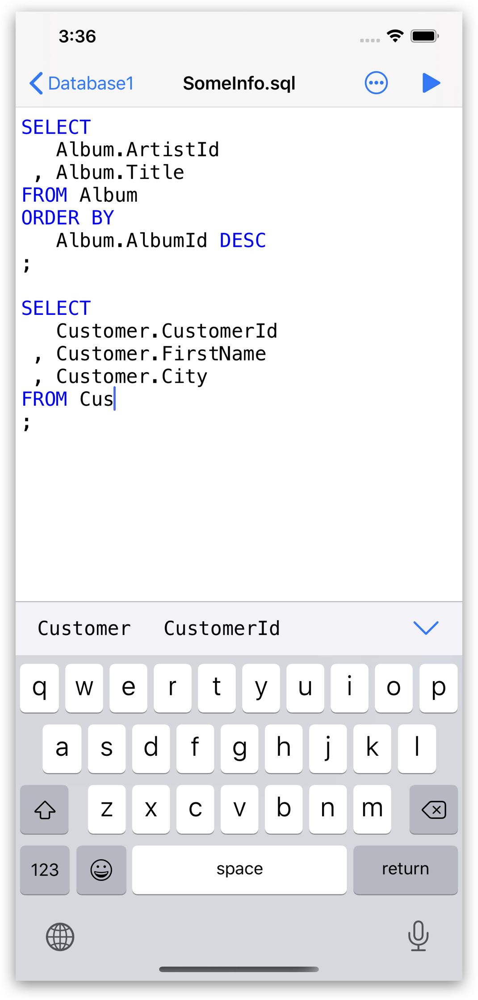
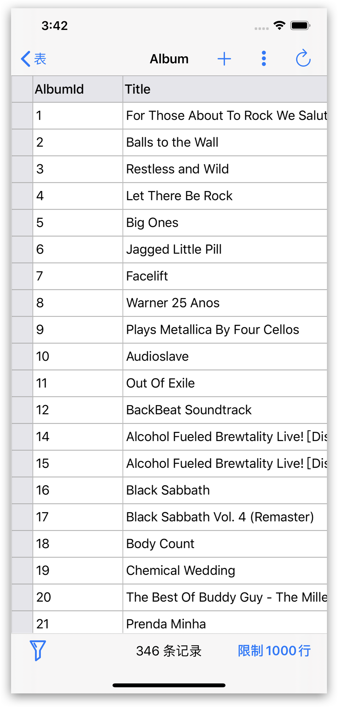
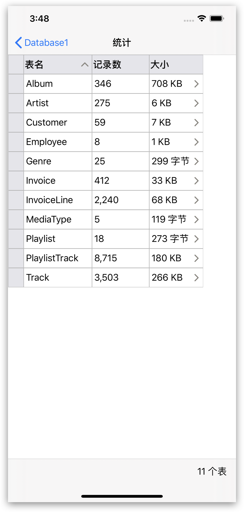

## SQLiteFlow
SQLiteFlow是为Mac和iOS平台开发的直观，稳定和易用的SQLite编辑器。

##  支持平台
[macOS 10.13+](./) / iOS 12.0+

## 下载
版本 4.3.1 | 2020-06-09 | <a href="/zh-Hans/iOS/ReleaseNotes" target="_blank">更新说明</a>
  

## 功能

**浏览**
- 管理文件。支持增加、删除、复制和重命名文件夹，SQLite数据库，SQL文件，CSV文件等。
- 支持从iCloud Drive中导入数据库。
- 支持打开外部SQL文件，CSV文件，过滤文件。
- 支持打开外部文件夹。需要iOS 13.0+或者iPadOS 13.0+支持。
- 支持显示最近使用文件。

*浏览*
 

**表列表**
- 支持显示表名和记录数。

*表列表*
 

**SQL编辑器**
- 支持多SQL执行。
- 自定义语法高亮。
- SQL代码自动补全。
- 格式化查询。

*SQL编辑器 - 多SQL执行*
 

**数据编辑器**
- 查看，编辑，添加和删除数据。
- 数据过滤器。
- 点击标题行排序
- 以十六进制编辑BLOB数据，如果可能，支持将其显示为图片。

*数据编辑器*
 

*数据过滤器*
 

**修改表结构**
- 查看，编辑和添加表字段，索引，外键，唯一约束和检查约束。
- 查看触发器。
- 查看表定义。

*修改表结构*
 

**连接**
- 支持SQLiteFlow(macOS)远程连接到在本应用中的数据库。

 

**数据库统计**
- 显示表数和表中的记录数。
- 显示每个表的占用空间，及每个表中数据占用的空间和和索引占用的空间。

*数据库统计*
 

**数据库比较**
- 支持生成使一个数据库转为另一个数据库SQL语句。
- 支持只显示两个数据库之间的不同的摘要信息。

*数据库比较*
 

**导入**
- 支持导入CSV数据。

*导入CSV数据。*
 

**导出**
- 支持导出表数据、视图数据和查询结果到CSV。

**多窗口**
- 为iPadOS 13支持多窗口。

**深色模式**
- 在iOS 13中支持深色模式。

**语言**
- [English](/) \| 简体中文 (Chinese, Simplified) \| [繁體中文 (Chinese, Traditional)](/zh-Hant/iOS)

## 联系我们
有问题或者新需求? 请到这里来<a href="https://github.com/SQLiteFlow/SQLiteFlow-Issues/issues" target="_blank">创建一个新Issue</a>。

