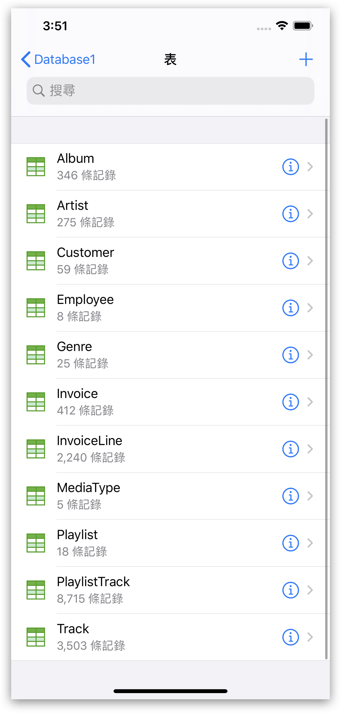
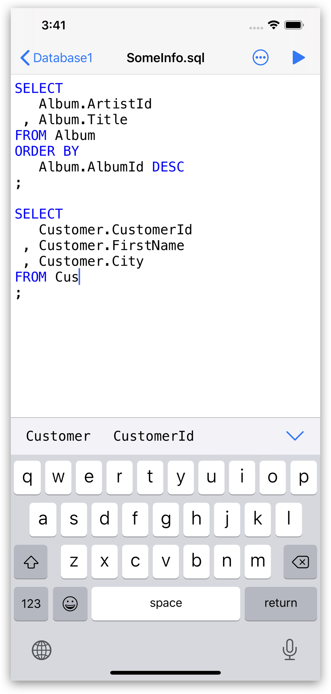
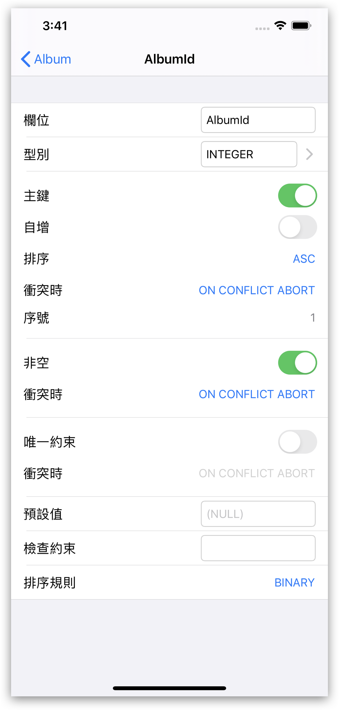
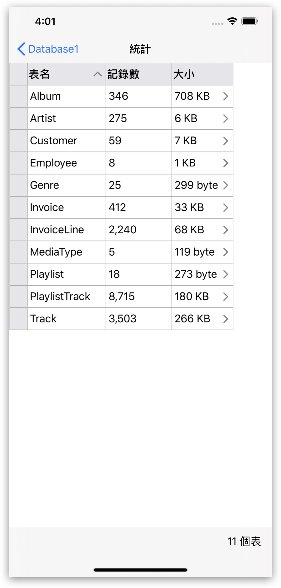
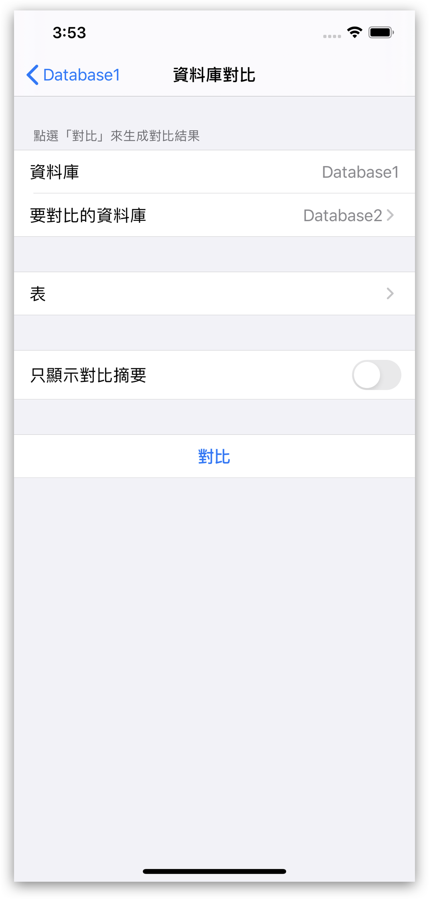
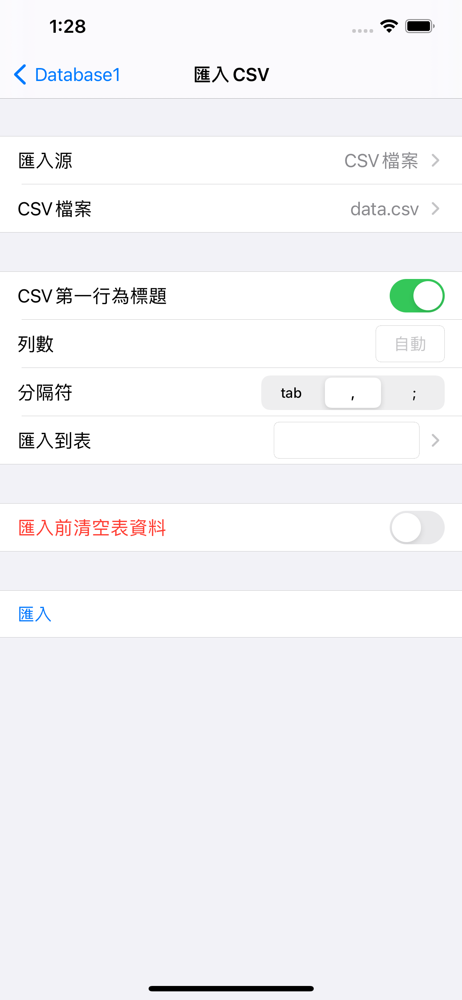

## SQLiteFlow
SQLiteFlow是為Mac和iOS平臺開發的直觀，穩定和易用的SQLite編輯器。

##  支援平臺
[macOS 10.12+](./) / iOS 12.0+

## 下載
版本 3.9.0 | 2019-09-20 | <a href="/zh-Hant/iOS/ReleaseNotes" target="_blank">更新說明</a>
  

## 功能

**資料庫列表**
- 管理資料庫。支援增加、刪除、複製和重新命名資料庫。
- 支援從iCould Drive中匯入資料庫。
- 支援用拖拽手勢來匯入或者匯出資料庫。
- 支援新建資料庫。

*資料庫列表*
 

**表列表**
- 支援顯示錶名和記錄數。

*表列表*
 

**SQL編輯器**
- 支援多SQL執行。
- 自定義語法高亮。
- SQL程式碼自動補全。
- 格式化查詢。

*SQL編輯器 - 多SQL執行*
 

**資料編輯器**
- 檢視，編輯，新增和刪除資料。
- 資料過濾器。
- 點選標題行排序
- 以十六進位制編輯BLOB資料，如果可能，支援將其顯示為圖片。

*資料編輯器*
 

*資料過濾器*
 

**修改表結構**
- 檢視，編輯和新增表字段，索引，外來鍵，唯一約束和檢查約束。
- 檢視觸發器。
- 查看錶定義。

*修改表結構*
 

**連線**
- 支援SQLiteFlow(macOS)遠端連線到在本應用中的資料庫。

*連線*
 

**資料庫統計**
- 顯示錶數和表中的記錄數。
- 顯示每個表的佔用空間，及每個表中資料佔用的空間和和索引佔用的空間。

*資料庫統計*
 

**資料庫比較**
- 支援生成使一個數據庫轉為另一個數據庫SQL語句。
- 支援只顯示兩個資料庫之間的不同的摘要資訊。

*資料庫比較*
 

 

**匯入**
- 支援匯入CSV資料。

*匯入CSV資料。*
 

**匯出**
- 支援匯出表資料、檢視資料和查詢結果到CSV。

**語言**
- [English](/) \| [简体中文 (Chinese, Simplified)](/zh-Hans/iOS) \| 繁體中文 (Chinese, Traditional)

## 聯絡我們
有問題或者新需求? 請到這裡來<a href="https://github.com/SQLiteFlow/SQLiteFlow-Issues/issues" target="_blank">建立一個新Issue</a>。

