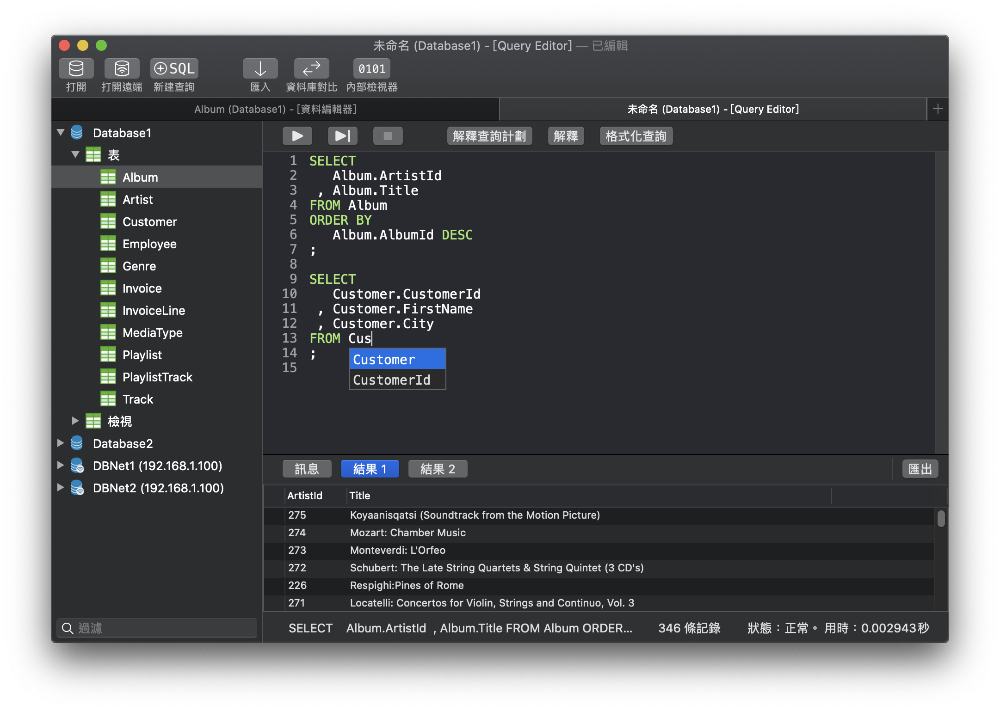
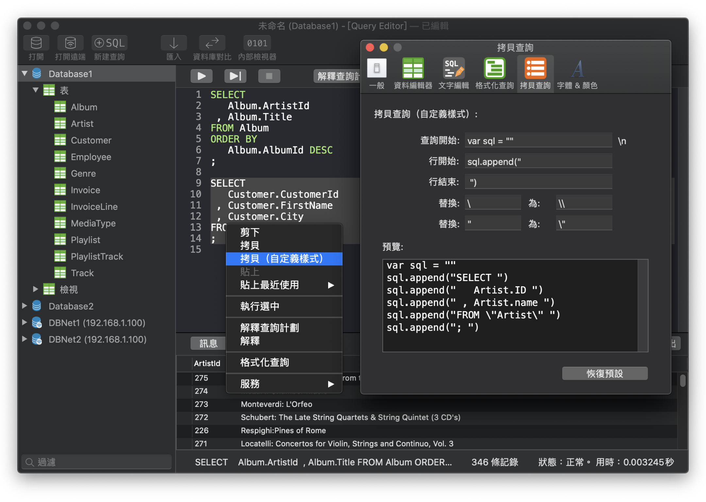
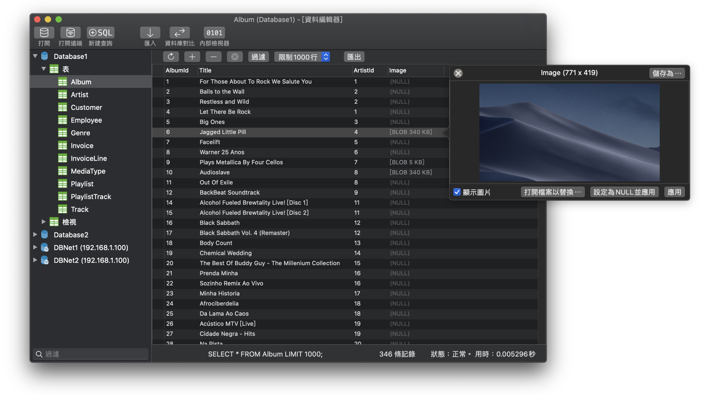
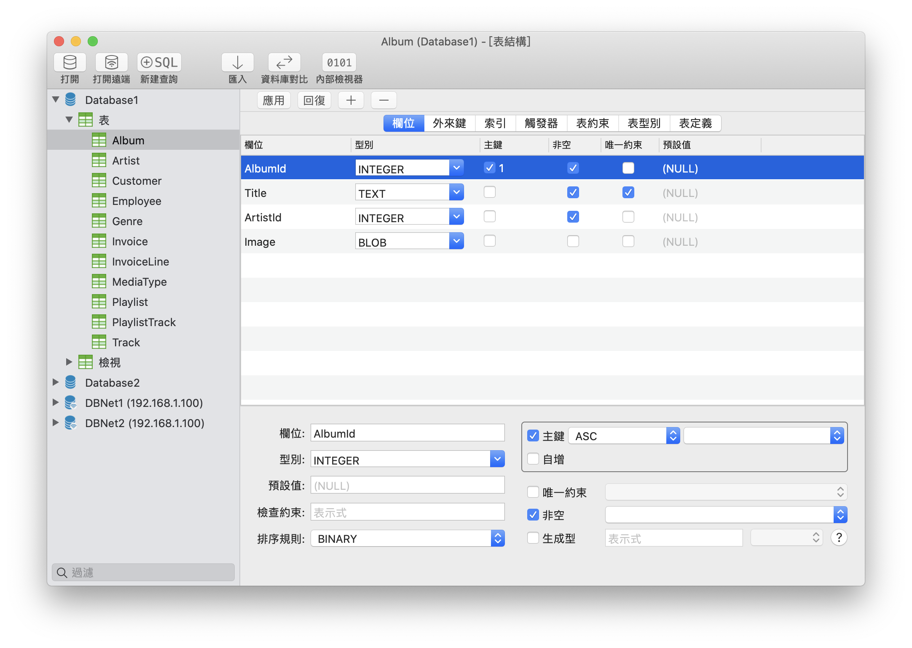
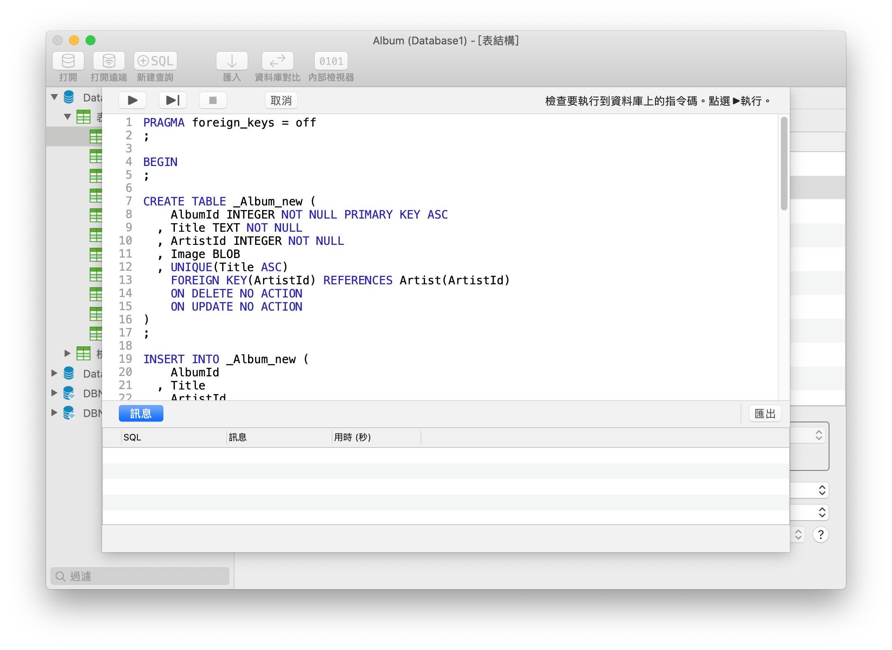
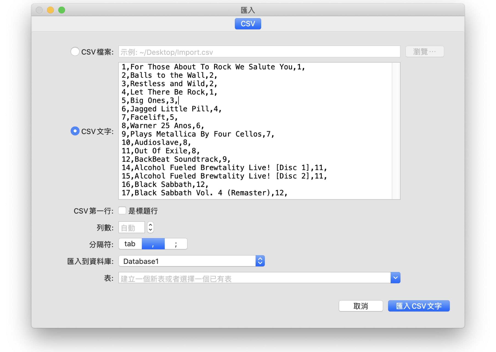
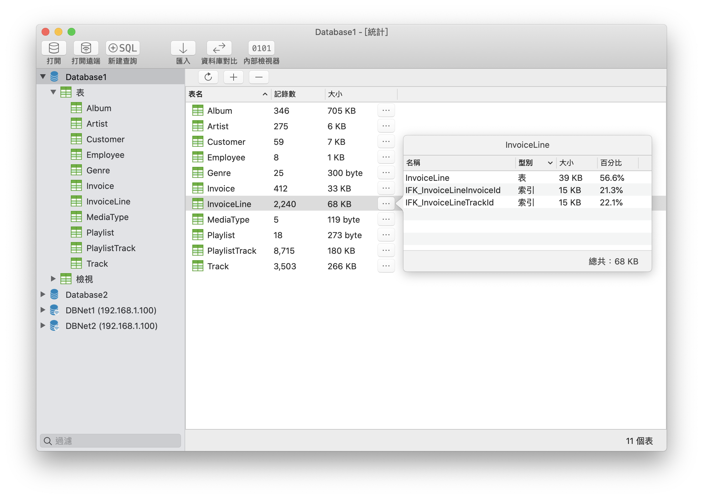
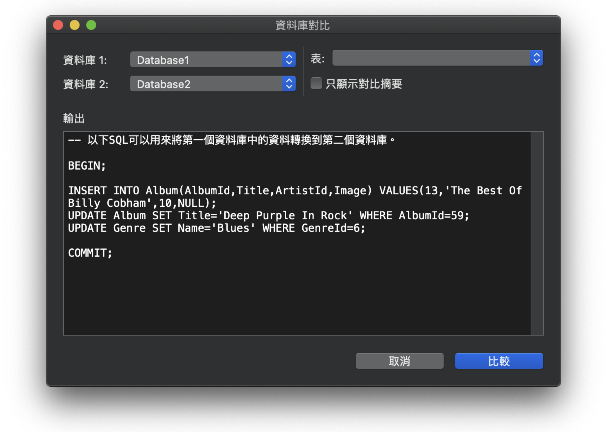
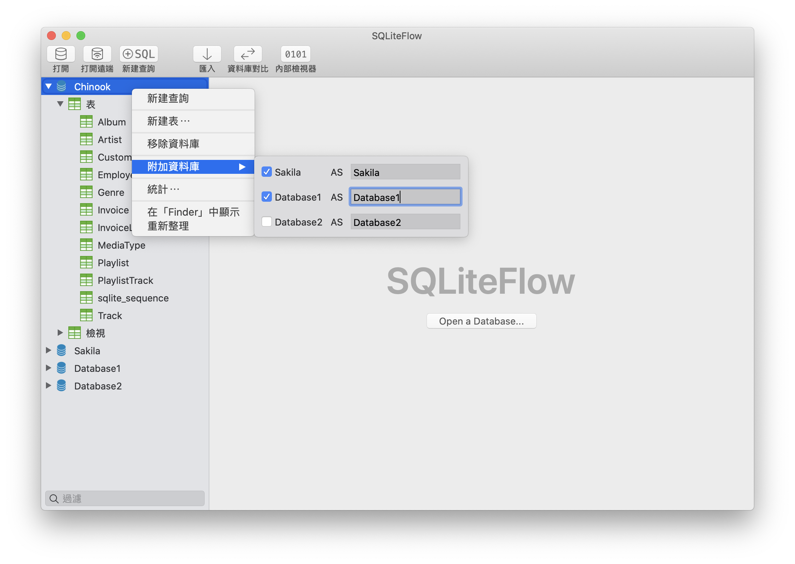
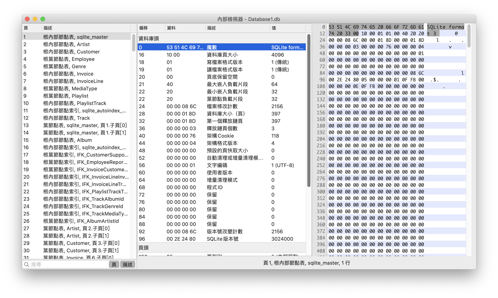

## SQLiteFlow
SQLiteFlow是為Mac和iOS平臺開發的直觀，穩定和易用的SQLite編輯器。

## 支援平臺
macOS 10.14+ / [iOS 13.0+](iOS)

## 下載
版本 4.9.2 | 2021-04-20 | <a href="ReleaseNotes" target="_blank">更新說明</a>
  

## Features

**SQL編輯器**

- 支援多SQL執行。
- 自定義語法高亮。
- SQL程式碼自動補全。
- 格式化查詢。
- 自定義風格拷貝查詢。
- 貼上最近使用查詢會話。
- 解釋查詢。

*SQL編輯器 - 支援多SQL執行。*

*SQL編輯器- 自定義風格拷貝查詢與它的設定頁面。*

**資料編輯器**

- 檢視，編輯，新增和刪除資料。
- 資料過濾器。
- 以十六進位制編輯BLOB資料，如果可能，支援將其顯示為圖片。
- 拷貝資料到CSV。

*資料編輯器*

**修改表結構**

- 檢視，編輯和新增表字段，索引，外來鍵，唯一約束和檢查約束。
- 檢視觸發器。
- 查看錶定義。
- 預覽修改表結構的SQL。

*修改表結構 - 修改欄位*

*修改表結構 - 預覽修改*

**匯入**
- 支援匯入CSV資料。

*匯入文字*

**深色模式**
- 在macOS 10.14+中支援深色模式。

**資料庫統計**
- 顯示錶數和表中的記錄數。
- 顯示每個表的佔用空間，及每個表中資料佔用的空間和和索引佔用的空間。

*資料庫統計*

**資料庫比較**
- 支援生成使一個數據庫轉為另一個數據庫SQL語句。
- 支援只顯示兩個資料庫之間的不同的摘要資訊。

**遠端連線**
- 支援遠端連線在SQLiteFlow(iOS)中的資料庫。

*遠端連線*

**附加資料庫**
- 無需任何程式碼，即可附加資料庫，幫您省下很多寫ATTACH DATABASE命令的時間。

*附加已開啟的資料庫*

**拖拽**
- 支援用拖拽操作來開啟資料庫和SQL指令碼檔案。
- 建立多視窗。

**內部檢視器**
- 檢視SQLite資料庫檔案，日誌檔案，WAL檔案或者WAL-索引檔案的內部結構。

*內部檢視器*

**自動處理資料庫檔名或者路徑變化**
- 比如，這使得SQLiteFlow對在iOS模擬器中的資料庫很友好。

**REGEXP運算子**
- 當您在偏好設定中開啟‘REGEXP運算子’後，您就可以在資料編輯器或者SQL編輯器中使用REGEXP運算子了。

**語言**
- [English](/) \| [简体中文 (Chinese, Simplified)](/zh-Hans) \| 繁體中文 (Chinese, Traditional) \| [日本語 (Japanese)](/ja)

## 聯絡我們
有問題或者新需求? 請到這裡來<a href="https://github.com/SQLiteFlow/SQLiteFlow-Issues/issues" target="_blank">建立一個新Issue</a>。

